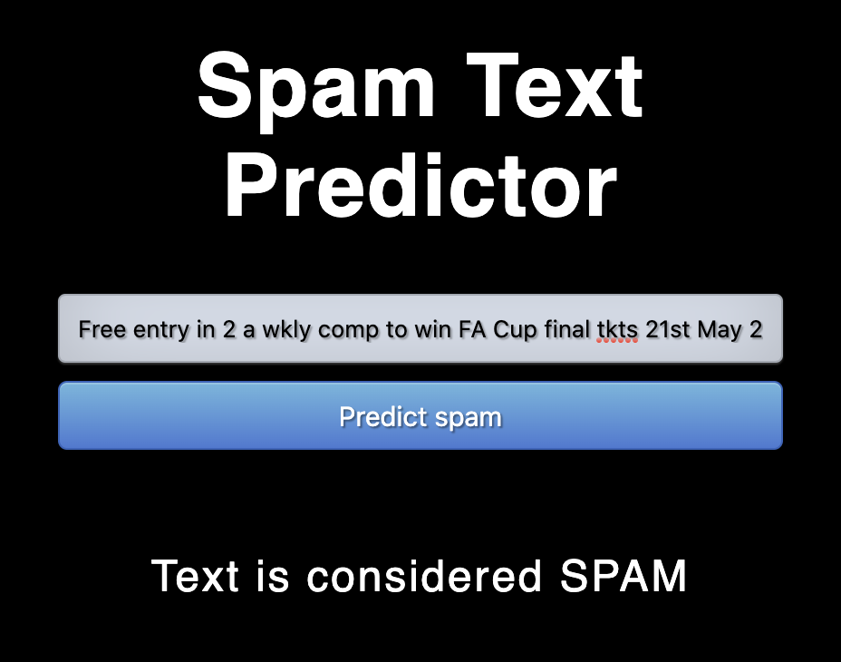
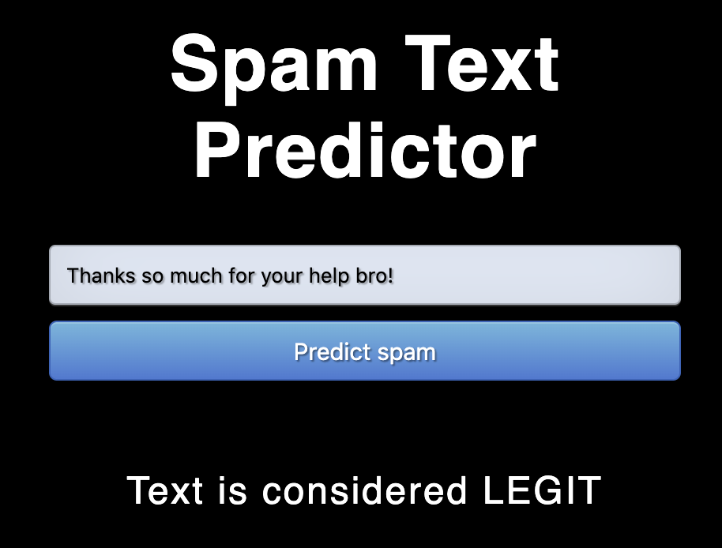

# Machine Learning Deployment Tutorials
Launch machine learning models into production using flask, docker etc.

# 1. Predict Spam

This application builds off of Lynda.com's "NLP with Python for Machine Learning Essential Training Course". The course dicusses the fundamentals of NLP with applications to text messages identified as 'spam' or 'ham' (legitimate), building different machine learning to predict future results. The application takes these models and makes it consumable for the user, allowing them to input any new text message.

## Environment and tools
1. scikit-learn
2. pandas
3. numpy
4. flask

## Installation

`pip install scikit-learn pandas numpy flask`

`python3 model.py`

`python3 app.py`





Output:

```
{
  "output": "SPAM"
}
```

## Citing

```
@misc{James:2020,
  Author = {J.T. Bassett}
  Contributor = {Abhinav Sagar},
  Title = {Machine-Learning-Deployment-Tutorials},
  Year = {2020},
  Publisher = {GitHub},
  Journal = {GitHub repository},
  Howpublished = {\url{https://github.com/JTBassett}}
}
```

## Contacts

1. [Linkedin](https://in.linkedin.com/in/bassettjames)
2. [GitHub](https://github.com/JTBassett)

## License

```
Copyright (c) 2020 J.T. Bassett

Permission is hereby granted, free of charge, to any person obtaining a copy
of this software and associated documentation files (the "Software"), to deal
in the Software without restriction, including without limitation the rights
to use, copy, modify, merge, publish, distribute, sublicense, and/or sell
copies of the Software, and to permit persons to whom the Software is
furnished to do so, subject to the following conditions:

The above copyright notice and this permission notice shall be included in all
copies or substantial portions of the Software.

THE SOFTWARE IS PROVIDED "AS IS", WITHOUT WARRANTY OF ANY KIND, EXPRESS OR
IMPLIED, INCLUDING BUT NOT LIMITED TO THE WARRANTIES OF MERCHANTABILITY,
FITNESS FOR A PARTICULAR PURPOSE AND NONINFRINGEMENT. IN NO EVENT SHALL THE
AUTHORS OR COPYRIGHT HOLDERS BE LIABLE FOR ANY CLAIM, DAMAGES OR OTHER
LIABILITY, WHETHER IN AN ACTION OF CONTRACT, TORT OR OTHERWISE, ARISING FROM,
OUT OF OR IN CONNECTION WITH THE SOFTWARE OR THE USE OR OTHER DEALINGS IN THE
SOFTWARE.
```
